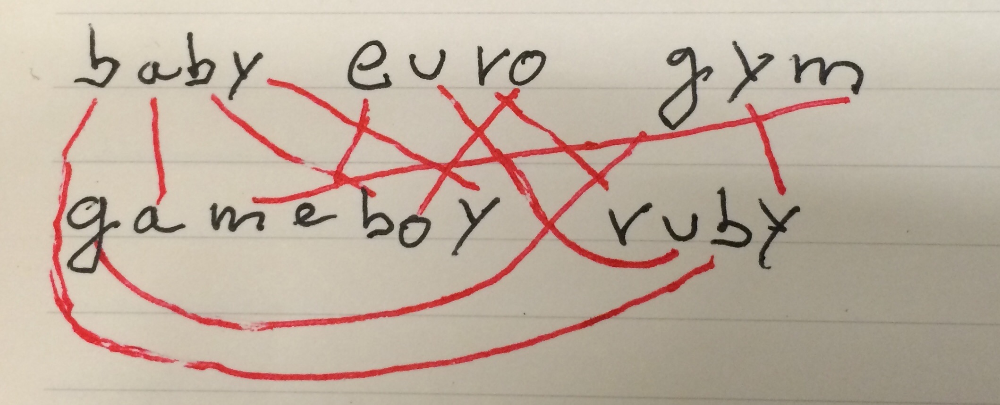

# Baby Euro Gym

Welcome to Baby Euro Gym.  
Today you'll learn how to write a **GameBoy emulator in Ruby**. More or less.

## How does this work?
This tutorial is a work in progress.  
By the end of the tutorial, you should:

- Be familiar with the internals of emulators
- Know how a real life GameBoy works (more or less)
- Have your own emulator (that is capable of rendering the first frame of a game)
- Have a small idea of how to continue developing the emulator
- Have spent a nice saturday afternoon writing [irresponsible ruby](http://ajipirijou.com/talks/how-i-built-my-own-tpp-part-4/)

Buckle up, Billy, because this train has no *rails*!

## Why the name?
*Baby Euro Gym* is an anagram for *GameBoy Ruby*.

## Aknowledgments
Most of the content of this tutorial is based on [Imran Nazar's excellent GameBoy Emulation in Javascript](http://imrannazar.com/GameBoy-Emulation-in-JavaScript) tutorial.

If you'd like to know the origin of this tutorial, you might want to read the story
of [How I built my own Twitch-Plays-Pokémon](http://ajipirijou.com/talks/how-i-built-my-own-tpp-part-1/).

Most of the code here is copied from [mimey](https://github.com/eljojo/mimey), which is a fork of [@janogonzales' mimey](https://github.com/janogonzalez/mimey).
